# What can you expect?
## The slides contain
- An introduction to doing spatial data science
- A smattering of Python code
- Lots of graphs and figures
- Some insights about walkability in Wellington

# Motivation

## The global open data movement
- Data sources
    - [OpenStreetMap](https://www.openstreetmap.org/)
    - Data.gov*: data.gov, data.govt.nz, data.gov.uk, data.gov.in
- Inspiring people generating tools / insights with open data
    - [Kuan Butts](http://kuanbutts.com/)
    - [Geoff Boeing](https://geoffboeing.com/)

## Limited analysis of NZ
I want to learn about the coolest little capital in the world

- How are we being served?
    - housing
    - public transport
    - amenities
    - infrastructure

- Can things be better?

<!--

## Aspiring to Data "Journalism"
> The purpose of journalism is thus to provide citizens with the information they need to make the best possible decisions about their lives, their communities, their societies, and their governments.

\begin{flushright}
\small
\textit{– American Press Institute}
\end{flushright} -->

## .. but I'm still just a Data Scientist
\centering
{ width=35% }

\begin{center}
\Large
Audiens Cave
\end{center}

# Walkability

## Importance
> \alert{Reducing car reliance} and encouraging \alert{more transport-related physical activity} are now recognised as beneficial objectives from health, social and environmental perspectives. Evidence is accumulating that a number of \alert{built environment attributes} are associated with the \alert{likelihood of residents using active transport}.

\begin{flushright}
\small
\textit{– Measuring neighbourhood walkability in NZ cities}
\end{flushright}

## Need
\centering
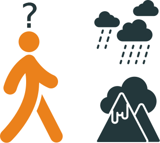{ width=30% }

Unlike cars, pedestrians are sensitive to their environment; changes to it can impact the _walking experience_ or the _decision to walk_.

## Task
> We'll explore the \alert{impact of hilly terrain on walkability} Specifically, on walkability to \alert{council playgrounds} - an amenity that should be locally accessible on foot.

# Python package set up

## Main packages
\scriptsize

~~~~~~~~~~~~~~~~~~~~~~~~~~~~~~~~~~~~~~~~~~ {.python}
# Geoprocessing
import osmnx as ox                     # Processing OSM as graphs
import networkx as nx                  # Graph structure processing
import pandana as pa                   # Efficient accessibility computing
import geopandas                       # Processing geodataframes
from shapely.geometry import \
Point, Polygon, LineString             # Core geometric objects
~~~~~~~~~~~~~~~~~~~~~~~~~~~~~~~~~~~~~~~~~~

\normalsize

## Supporting packages
\scriptsize

~~~~~~~~~~~~~~~~~~~~~~~~~~~~~~~~~~~~~~~~~~ {.python}
# Plotting
import matplotlib.pyplot as plt       # Classic Python plotting package
import seaborn as sns                 # Ggplot2-like plotting in Python
import folium                         # Interactive, web-ready maps
from descartes import PolygonPatch    # Geometric patches for matplotlib

# General utilities
import yaml                           # Reading stored API keys
import numpy as np                    # Processing arrays and matrices
import pandas as import pd            # Processing dataframes

# Bayesian analysis
import pystan                         # Running Bayesian models
~~~~~~~~~~~~~~~~~~~~~~~~~~~~~~~~~~~~~~~~~~

\normalsize

# Spatial data science

## Overview
\centering
{ width=60% }

## Question
\begin{center}
What is the \alert{impact of hills} on \alert{walkability} to \alert{playgrounds} in Wellington?
\end{center}

# Space

## Wellington
\centering
{ width=100% }

# Abstraction: spatial primitives
## Points
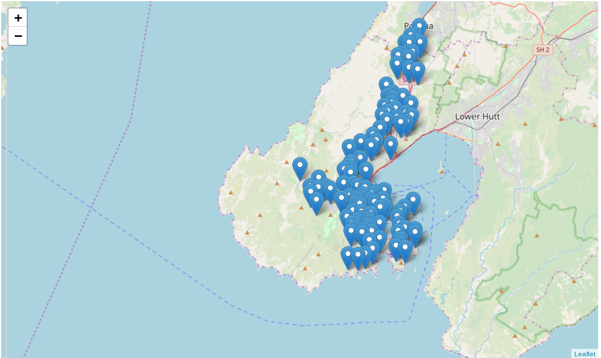{ width=70% }

- Point coordinates of playgrounds
- _Overlaid_ on map of Wellington

## Lines
{ width=60% }

- Line segments that define a street or in this case, a route.

## Polygons
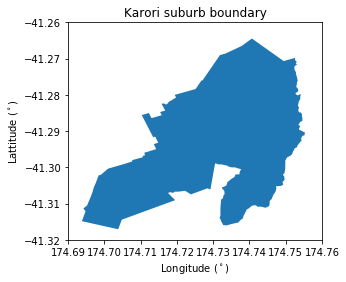{ width=60% }

- Poylgon boundary of suburb

## Complex abstractions
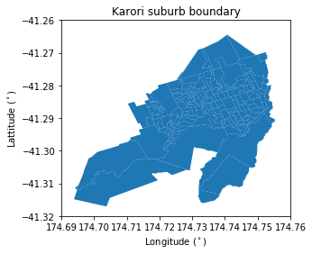{ width=60% }

- Poylgon boundary of suburb
- Polygon boundaries of meshblocks _within_ suburb

# Abstraction: map to graph
## Creating a street graph
\tiny
~~~~~~~~~~~~~~~~~~~~~~~~~~~~~~~~~~~~~~~~~~ {.python}
G_sub = ox.graph_from_point((wcc_playgrounds.ix[32]['lat'],
                             wcc_playgrounds.ix[32]['lon']),
                             distance=1500,
                             network_type='walk')
ox.plot_graph(G_sub, fig_height=8)
~~~~~~~~~~~~~~~~~~~~~~~~~~~~~~~~~~~~~~~~~~
\normalsize
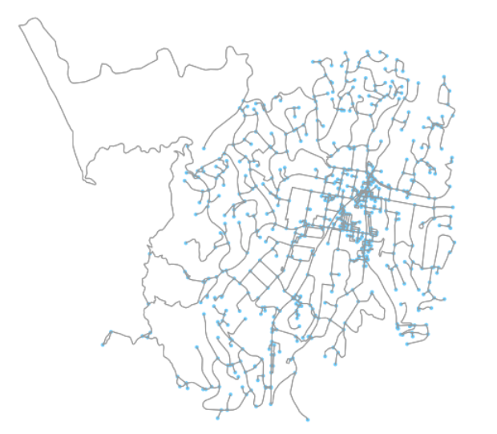{ width=45% }

Map represented as street \alert{edges} with intersections as \alert{nodes}

# Data: spatial primitives
## Spatial entities in geodataframes
\tiny
~~~~~~~~~~~~~~~~~~~~~~~~~~~~~~~~~~~~~~~~~~ {.python}
(wlg_meshblock_suburbs_ov
.query('suburb == "Karori"')[['suburb', 'postcode', 'MB2019_V1_00', 'geometry']]
.head())
~~~~~~~~~~~~~~~~~~~~~~~~~~~~~~~~~~~~~~~~~~
\normalsize
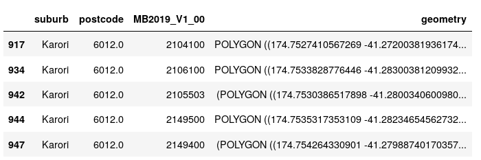{ width=70% }

Points, lines and polygons can all be compressed in a \alert{geodataframe}.

# Data: graphs
## Graph nodes in geodataframes
\tiny
~~~~~~~~~~~~~~~~~~~~~~~~~~~~~~~~~~~~~~~~~~ {.python}
nodes_gdfs, edges_gdfs = ox.graph_to_gdfs(G_sub)
nodes_gdfs.head()
~~~~~~~~~~~~~~~~~~~~~~~~~~~~~~~~~~~~~~~~~~
\normalsize

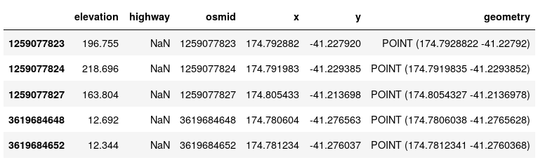{ width=80% }

## Graph edges in geodataframes
\tiny
~~~~~~~~~~~~~~~~~~~~~~~~~~~~~~~~~~~~~~~~~~ {.python}
edges_gdfs[['name', 'grade', 'osmid', 'maxspeed']].head()
~~~~~~~~~~~~~~~~~~~~~~~~~~~~~~~~~~~~~~~~~~
\normalsize

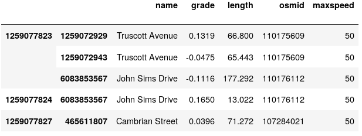{ width=80% }

## Data used for analysis
- \alert{Street graph}: with street gradient attribute for edges
- WCC playgrounds represented as \alert{points}
- Suburb boundaries defined by WCC as \alert{polygons}

# Model 1

## Approximating walkability as accessibility
Just to make life confusing, there are several definitions of accessibility. For the following analyses, accessibility is:

- an \alert{objective} metric
- calculated with a street graph and points of interest (POIs)
    - e.g. Wellington street graph and playground locations
- calculated with a specific \alert{unit} of interest
    - e.g. distance, travel time, total travel time etc.
- limited to _nearest_ POI

## How to calculate accessibility
\centering
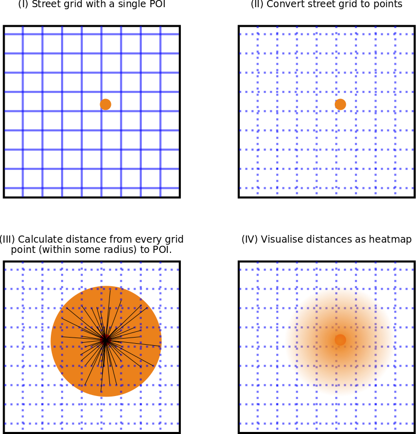{ width=60% }

## Accessibility on streets
{ width=60% }

- Find closest street graph nodes to: start and park
- Find shortest part between start and park nodes
- Sum edge weights of shortest path

## Efficient accessibility with Pandana
\centering
{ width=60% }

# Model 2

## Bayesian modelling
> From the observed accessibility data, what is the \alert{average accessibility} to a playground across the different Wellington suburbs?

## Set up Bayesian model
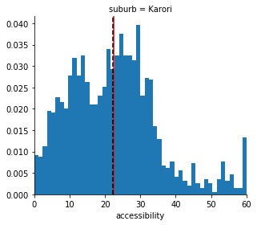{ width=50% }

- Model individual suburb accessibility ($A_{s}$) as a \alert{lower value truncated normal distribution}.
- Normal distribution: $A_{s} \sim N(\mu, \sigma)$
- Truncation condition: $A_{s} \in [0, \inf]$

## Efficient Bayesian modelling with Stan
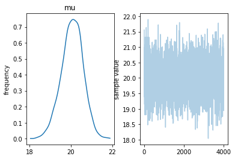{ width=60% }

- Stan model output for $\mu$ (labelled as mu)
- Samples of $\mu$ drawn by Stan

# Insights (mostly visual)

## Street graph with gradients
:::: {.columns}
::: {.column width="50%"}
\centering
{ width=80% }

- All edges (green ~ flat gradient)
:::
::: {.column width="50%"}
\centering
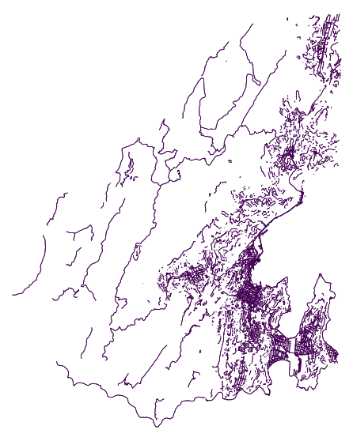{ width=80% }

- Edges within 5% absolute gradient
:::
::::

## Hills vs. flat land
:::: {.columns}
::: {.column width="50%"}
\centering
{ width=100% }

- Assuming single speed
:::
::: {.column width="50%"}
\centering
{ width=100% }

- Accounting for speed variability due to hills
:::
::::

## Impact of hills on playground accessibility
\centering
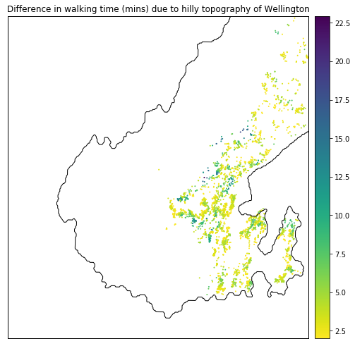{ width=60% }

## Accessibility by suburb
\centering
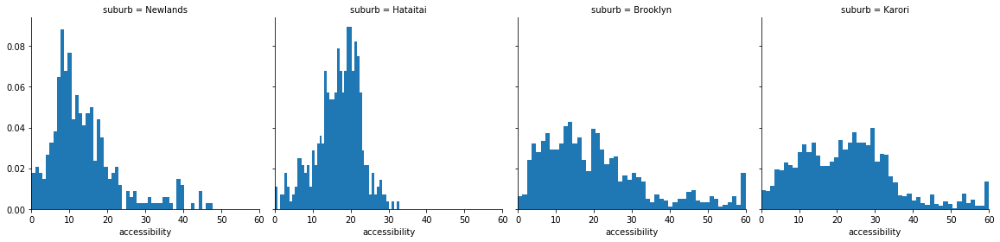{ width=100% }

## Modelling playground accessibility by suburb
\centering
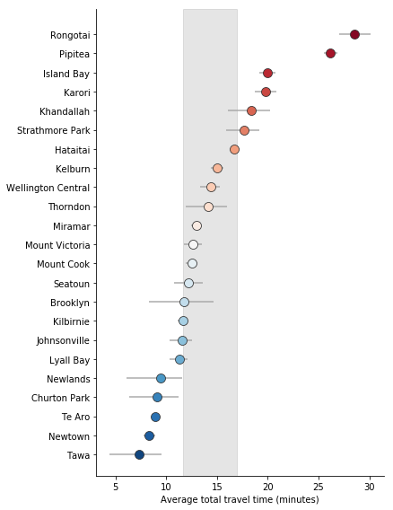{ width=50% }

## What have we learned?
- Hills have an impact on total travel time. Differences in total travel time can be up to 20 minutes.
- Wellington suburbs average 12-17 minutes in total travel time to nearest playground.
- But, there is a large variation _within_ suburbs.

## Lots more work to do!
- Making graphs better
- Removing the 60 minute spikes from the Bayesian modelling
- Exploring the heterogeneity in accessibility _within_ suburbs
- Impact of including school playgrounds in the analysis
- Impact of adding a new council playground (e.g. Berhampore playground coming in ~2020)

## Resources
- Write up on https://shriv.github.io
- Code in https://github.com/shriv

## Image Credits
\tiny
- Created by Thibault Geffroy for NounProject
- Created by Thuy Nguyen for NounProject
- Created by Christopher Smith for NounProject
- Created by ProSymbols for NounProject
