# What can you expect?
## The slides contain
- An introduction to doing spatial data science
- An introduction to statistical models
- Insights about walkability in Wellington
- Lots of graphs and figures

# Motivation

## The global FOSS4G movement
- Open data sources
    - [OpenStreetMap](https://www.openstreetmap.org/)
    - Data.gov*: data.gov, data.govt.nz, data.gov.uk, data.gov.in
- Open source packages
    - osmnx, pandana, networkx, geopandas in Python
    - sf, rgdal, ggmap in R
    - QGIS

## Inspiring people: Modelling critical infrastructure shutdown
\centering
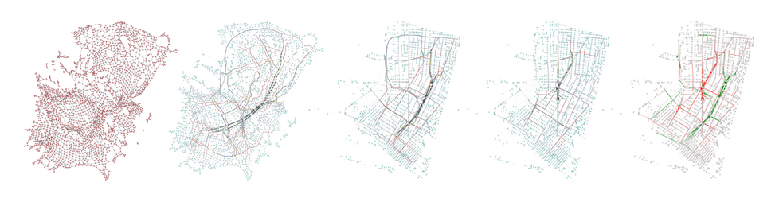{ width=100% }

- [Kuan Butts](http://kuanbutts.com/)

## Inspiring people: Urban form and morphology
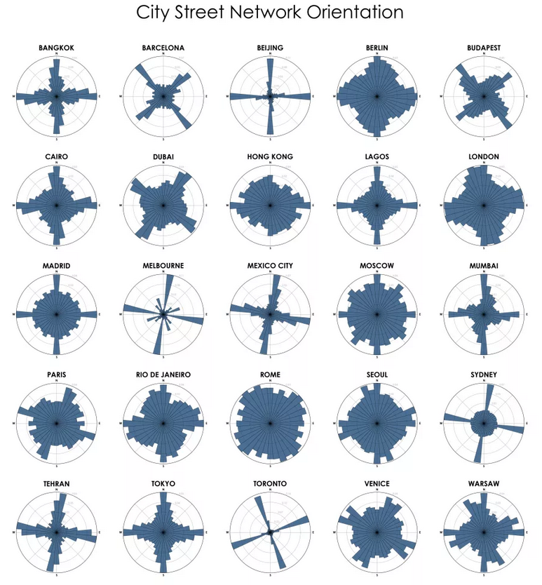{ width=55% }

- [Geoff Boeing](https://geoffboeing.com/)

## Inspiring people: Propensity to cycle
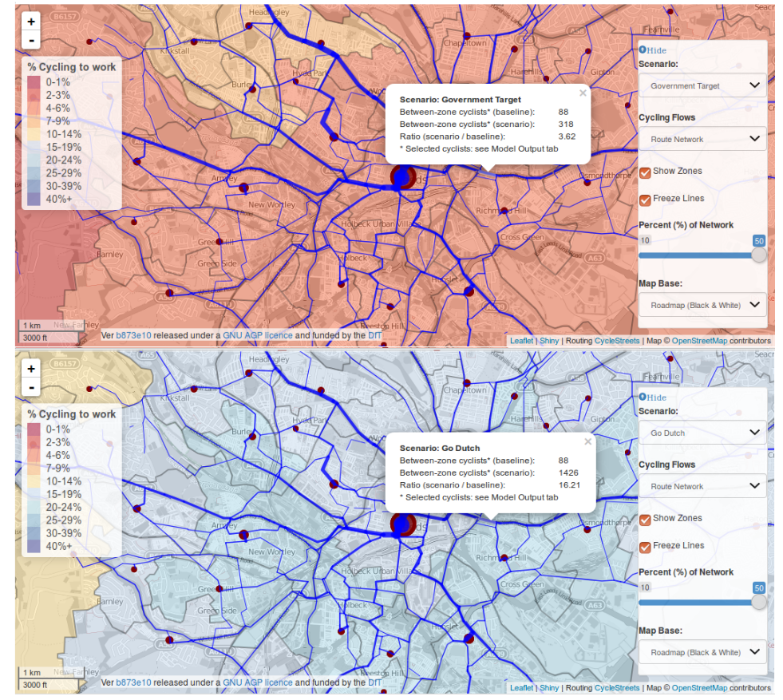{ width=70% }

- [Robin Lovelace](https://www.robinlovelace.net/2017/05/02/can-geographic-data-save-the-world/)

# Walkability

## Importance
> \alert{Reducing car reliance} and encouraging \alert{more transport-related physical activity} are now recognised as beneficial objectives from health, social and environmental perspectives. Evidence is accumulating that a number of \alert{built environment attributes} are associated with the \alert{likelihood of residents using active transport}.

\begin{flushright}
\small
\textit{– Measuring neighbourhood walkability in NZ cities}
\end{flushright}

## Need
\centering
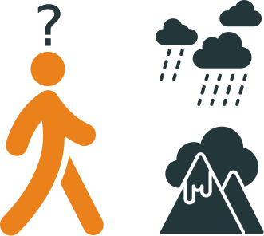{ width=30% }

Unlike cars, pedestrians are sensitive to their environment; changes to it can impact the _walking experience_ or the _decision to walk_.

## Task
> We'll explore the \alert{impact of hilly terrain on walkability} Specifically, on walkability to \alert{council playgrounds} - an amenity that should be locally accessible on foot.

## Playground access
- Council engagement for their recent Play Policy showed:
    - 41% of playground users walked and 45% drove.
    - 58% of playground users go to their _nearest_ playground.

<!--
# Python package set up

## Main packages
\scriptsize

~~~~~~~~~~~~~~~~~~~~~~~~~~~~~~~~~~~~~~~~~~ {.python}
# Geoprocessing
import osmnx as ox                     # Processing OSM as graphs
import networkx as nx                  # Graph structure processing
import pandana as pa                   # Efficient accessibility computing
import geopandas                       # Processing geodataframes
from shapely.geometry import \
Point, Polygon, LineString             # Core geometric objects
~~~~~~~~~~~~~~~~~~~~~~~~~~~~~~~~~~~~~~~~~~

\normalsize

## Supporting packages
\scriptsize

~~~~~~~~~~~~~~~~~~~~~~~~~~~~~~~~~~~~~~~~~~ {.python}
# Plotting
import matplotlib.pyplot as plt       # Classic Python plotting package
import seaborn as sns                 # Ggplot2-like plotting in Python
import folium                         # Interactive, web-ready maps
from descartes import PolygonPatch    # Geometric patches for matplotlib

# General utilities
import yaml                           # Reading stored API keys
import numpy as np                    # Processing arrays and matrices
import pandas as import pd            # Processing dataframes

# Bayesian analysis
import pystan                         # Running Bayesian models
~~~~~~~~~~~~~~~~~~~~~~~~~~~~~~~~~~~~~~~~~~

\normalsize -->

# Spatial data science

## Overview
\centering
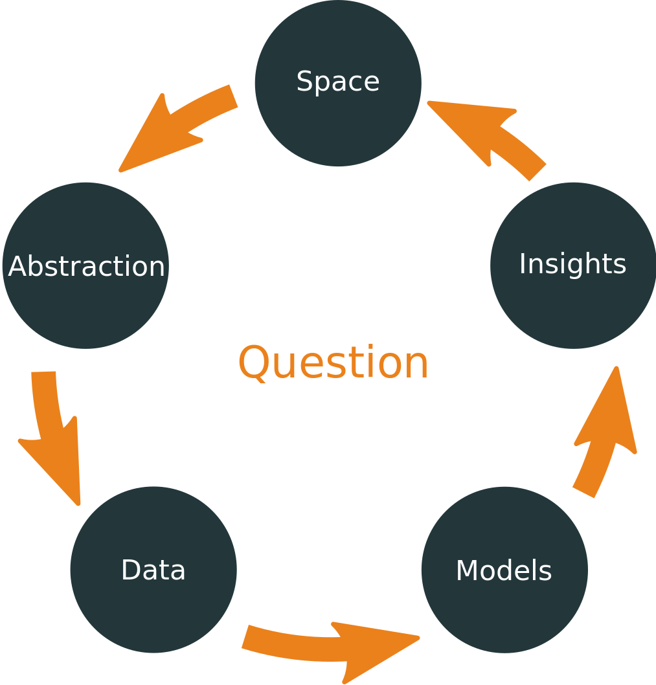{ width=60% }

## Question
\begin{center}
What is the \alert{impact of hills} on \alert{walkability} to \alert{playgrounds} in Wellington?
\end{center}

# Space

## Wellington
\centering
{ width=100% }

# Abstraction: spatial primitives
## Points
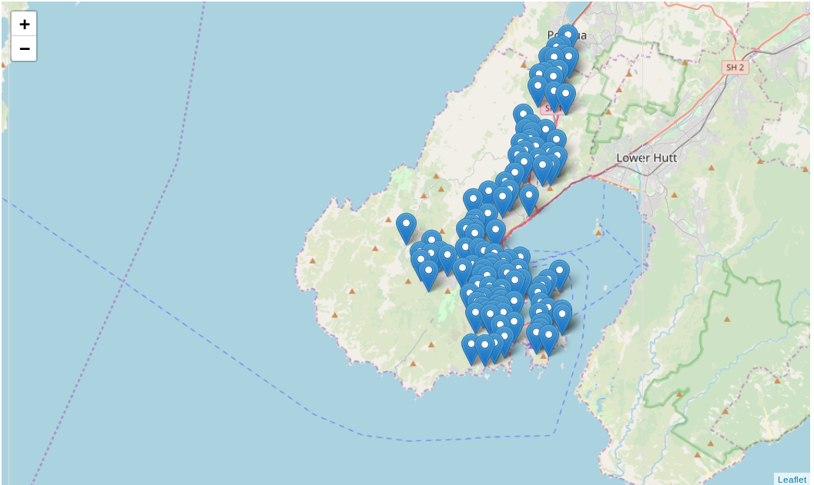{ width=70% }

- Point coordinates of playgrounds
- _Overlaid_ on map of Wellington

## Lines
{ width=60% }

- Line segments that define a street or in this case, a route.

## Polygons
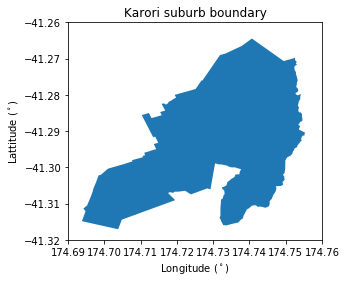{ width=60% }

- Poylgon boundary of suburb

## Complex abstractions
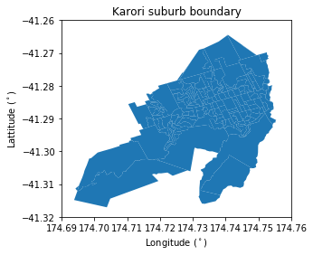{ width=60% }

- Poylgon boundary of suburb
- Polygon boundaries of meshblocks _within_ suburb

# Abstraction: map to graph
## What is a graph?
\centering
{ width=60% }

- Nodes / vertices
- Edges
- Edges and nodes can have associated values

## Creating a street graph
<!-- \tiny
~~~~~~~~~~~~~~~~~~~~~~~~~~~~~~~~~~~~~~~~~~ {.python}
G_sub = ox.graph_from_point((wcc_playgrounds.ix[32]['lat'],
                             wcc_playgrounds.ix[32]['lon']),
                             distance=1500,
                             network_type='walk')
ox.plot_graph(G_sub, fig_height=8)
~~~~~~~~~~~~~~~~~~~~~~~~~~~~~~~~~~~~~~~~~~
\normalsize -->
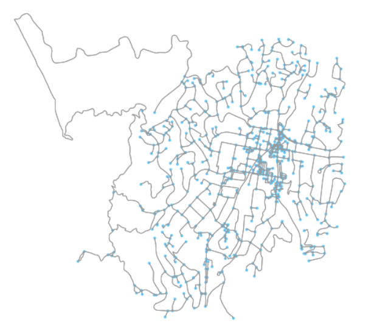{ width=60% }

Map represented as street \alert{edges} with intersections as \alert{nodes}

# Data: spatial primitives
## Spatial entities in geodataframes
<!-- \tiny
~~~~~~~~~~~~~~~~~~~~~~~~~~~~~~~~~~~~~~~~~~ {.python}
(wlg_meshblock_suburbs_ov
.query('suburb == "Karori"')[['suburb', 'postcode', 'MB2019_V1_00', 'geometry']]
.head())
~~~~~~~~~~~~~~~~~~~~~~~~~~~~~~~~~~~~~~~~~~
\normalsize -->
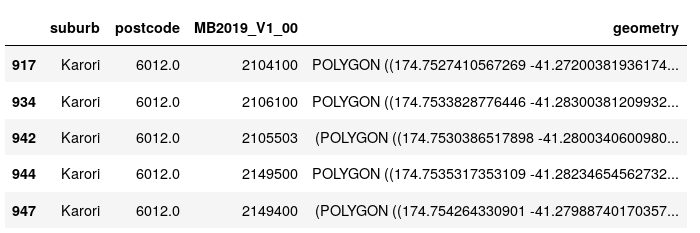{ width=70% }

Points, lines and polygons can all be compressed in a \alert{geodataframe}.

# Data: graphs
## Graph nodes in geodataframes
<!-- \tiny
~~~~~~~~~~~~~~~~~~~~~~~~~~~~~~~~~~~~~~~~~~ {.python}
nodes_gdfs, edges_gdfs = ox.graph_to_gdfs(G_sub)
nodes_gdfs.head()
~~~~~~~~~~~~~~~~~~~~~~~~~~~~~~~~~~~~~~~~~~
\normalsize -->

{ width=80% }

## Graph edges in geodataframes
<!-- \tiny
~~~~~~~~~~~~~~~~~~~~~~~~~~~~~~~~~~~~~~~~~~ {.python}
edges_gdfs[['name', 'grade', 'osmid', 'maxspeed']].head()
~~~~~~~~~~~~~~~~~~~~~~~~~~~~~~~~~~~~~~~~~~
\normalsize -->

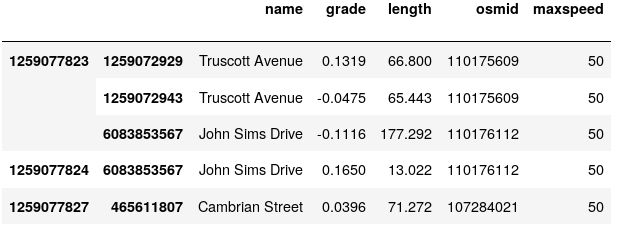{ width=80% }

## Data used for analysis
- \alert{Street graph}: with street gradient attribute for edges
- WCC playgrounds represented as \alert{points}
- Suburb boundaries defined by WCC as \alert{polygons}
- LINZ residential areas as \alert{polygons}

# Data: enriched and aggregated for modelling

## Approximating walkability as accessibility
Just to make life confusing, there are several definitions of accessibility. For the following analyses, accessibility is:

- an \alert{objective} metric
- calculated with a \alert{street graph and points of interest (POIs)}
    - e.g. Wellington street graph and playground locations
- calculated with a \alert{specific unit} of interest
    - e.g. distance, travel time, total travel time etc.
- limited to \alert{nearest POI}

## How to calculate accessibility
\centering
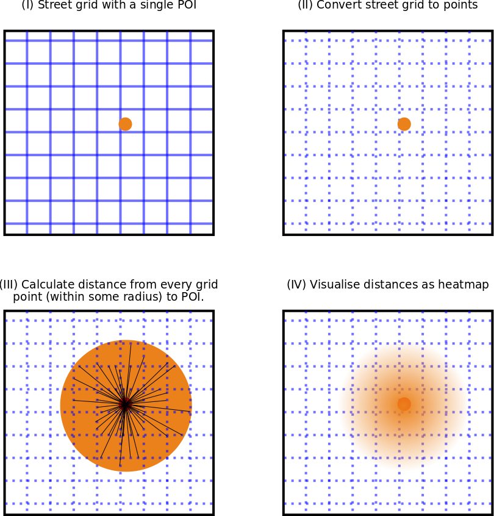{ width=60% }

## Accessibility on streets
{ width=60% }

- Find closest street graph nodes to: start and park
- Find shortest part between start and park nodes
- Sum edge weights of shortest path

## Efficient accessibility with Pandana
\centering
{ width=60% }

## Street graph with gradients
:::: {.columns}
::: {.column width="50%"}
\centering
{ width=80% }

- All edges (green ~ flat gradient)
:::
::: {.column width="50%"}
\centering
{ width=80% }

- Edges within 5% absolute gradient
:::
::::

## Hills vs. flat land
:::: {.columns}
::: {.column width="50%"}
\centering
{ width=100% }

- Assuming single speed
:::
::: {.column width="50%"}
\centering
{ width=100% }

- Accounting for speed variability due to hills
:::
::::

## Difference due to hills
\centering
{ width=60% }

## Accessibility distributions by suburb
\centering
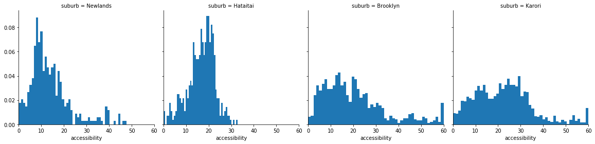{ width=100% }

## Spatial filters
:::: {.columns}
::: {.column width="50%"}

\centering
{ width=100% }

- Residential area mask
:::
::: {.column width="50%"}
\centering
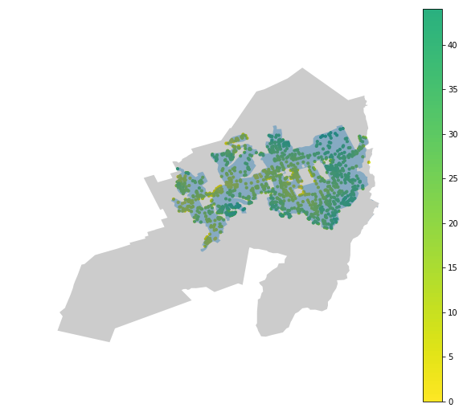{ width=100% }

- Filtered accessibility
:::
::::

## Why spatial filters are important: Rongotai
:::: {.columns}
::: {.column width="30%"}
\centering
{ width=100% }
:::
::: {.column width="30%"}

\centering
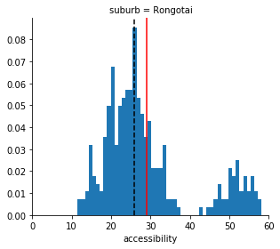{ width=100% }

- All
:::
::: {.column width="30%"}
\centering
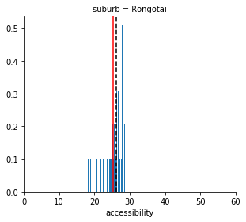{ width=100% }

- Filtered
:::
::::

# Model

## Bayesian modelling
-  From the observed accessibility data, what is the \alert{average accessibility} to a playground across the different Wellington suburbs?
- From the observed accessibility data, what is the \alert{variation in accessibility} to a playground within a Wellington suburb?

## Set up Bayesian model
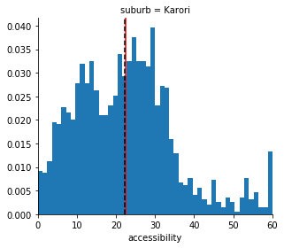{ width=50% }

- Model individual suburb accessibility ($A_{s}$) as a \alert{lower value truncated normal distribution}.
- Normal distribution: $A_{s} \sim N(\mu, \sigma)$
- Truncation condition: $A_{s} \in [0, \inf]$

## Efficient Bayesian modelling with Stan
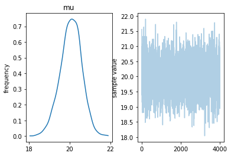{ width=60% }

- Stan model output for $\mu$ (labelled as mu)
- Samples of $\mu$ drawn by Stan

<!--
## Accessibility by suburb
\centering
{ width=100% } -->

## Modelling average playground accessibility by suburb
\centering
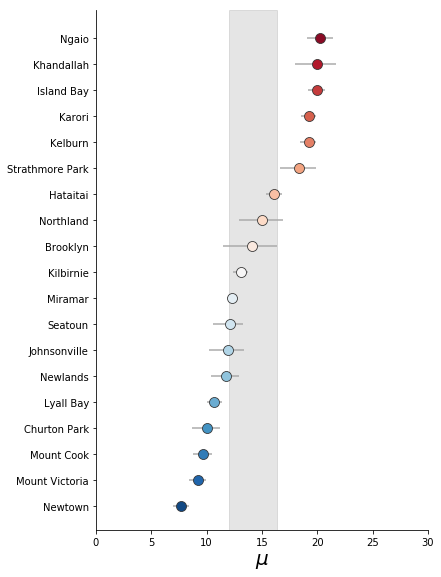{ width=50% }

## Modelling variability in playground accessibility by suburb
\centering
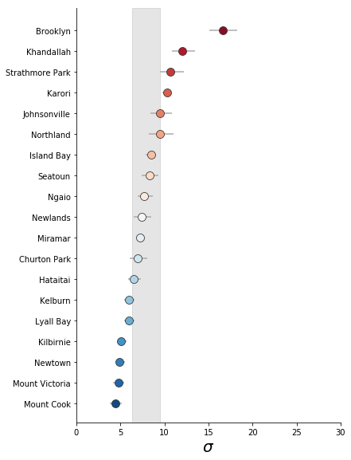{ width=50% }

## Making sense of model output
:::: {.columns}
::: {.column width="50%"}
\centering
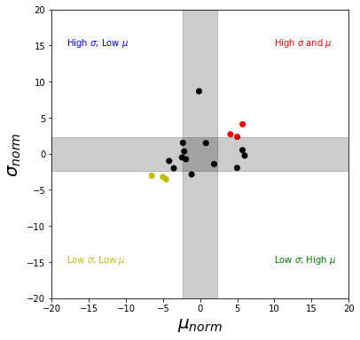{ width=100% }
:::
::: {.column width="50%"}
\centering
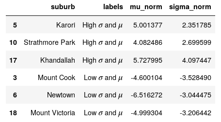{ width=100% }
:::
::::

## The best and worst of Wellington
\centering
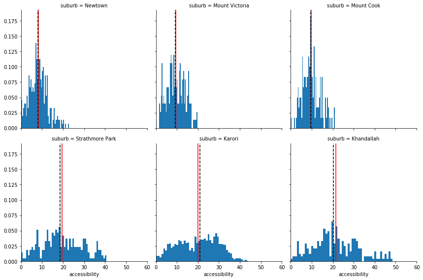{ width=90% }

# Conclusions

## What have we learned?
- Hills have a significant impact on total travel time.
- Wellington suburbs average 12-17 minutes in total travel time to nearest playground.
- But, there is a large variation _within_ suburbs.

## Lots more work to do!
- Impact of including school playgrounds in the analysis.
- Impact of adding a new council playground (e.g. Berhampore playground coming in ~2020).
- Areas within suburbs with poor accessibility. Are there any options nearby?
- Compare this analysis to WCC's recent [Play Space Policy](https://wellington.govt.nz/~/media/your-council/plans-policies-and-bylaws/plans-and-policies/a-to-z/play-spaces/play-spaces-policy.pdf?la=en).

## Resources
- Write up on https://shriv.github.io
- Code in https://github.com/shriv/accessibility-series/: to be updated

## Image Credits
\tiny
- Created by Thibault Geffroy for NounProject
- Created by Thuy Nguyen for NounProject
- Created by Christopher Smith for NounProject
- Created by ProSymbols for NounProject
- Graph illustrations from https://mathinsight.org/network_introduction
